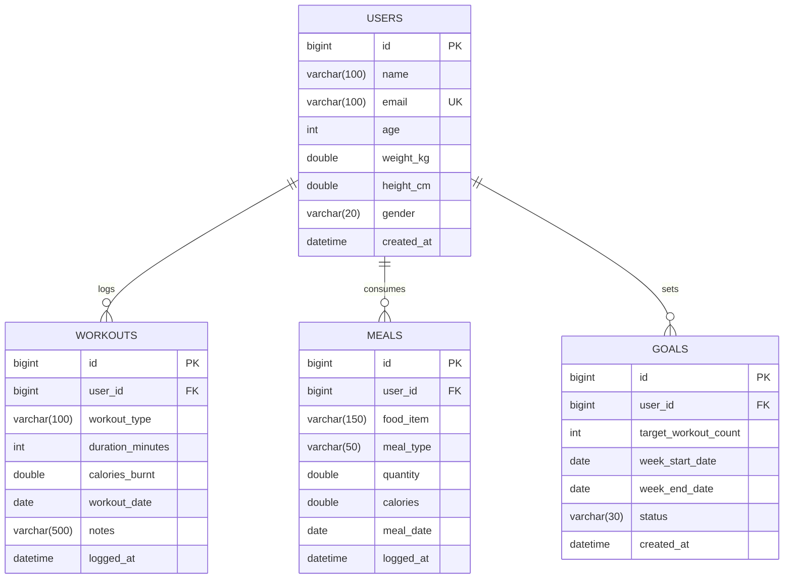

# FitLog — Personal Workout and Calorie Tracker

> **Project Leap — Java & DBMS Examination (Regulation 2023)**  
> **Course Code:** U28CS491 — Java Programming  
> **Institution:** Sri Eshwar College of Engineering, Coimbatore  
> **Register Number:** 722825243194  
> **Repository:** [https://github.com/shamilsj2025aids/fitlog.git](https://github.com/shamilsj2025aids/fitlog.git)  

---

## 1. Objective & Real-World Scenario
Fitness beginners frequently struggle to maintain a consistent log of their physical workouts and nutrition because paper diaries and spreadsheets are cumbersome and easily abandoned. **FitLog** solves this problem by delivering a robust, modular Spring Boot & MySQL backend that allows users to log daily workouts and meals, enforce strict business rules, view daily summaries of calories in vs. calories out, track weekly workout completion trends, and set personal weekly workout-count goals.

---

## 2. Assessment Rubrics Coverage

| Assessment Criteria | Max Marks | Implementation Highlights |
| :--- | :---: | :--- |
| **1. Technical Implementation** | **40** | Spring Boot 3.3.4, Spring Data JPA, MySQL 8.0, Full CRUD REST APIs, Swagger UI / OpenAPI 3, Interactive Web UI. |
| **2. System Design & Architecture** | **25** | Layered Architecture (Controller $\to$ Service $\to$ Repository $\to$ Entity), UML Class Diagram, MySQL ER Schema with Foreign Keys & Constraints. |
| **3. Code Quality & Efficiency** | **20** | Coding standards, Bean Validation (`@Valid`, `@PositiveOrZero`), centralized `@RestControllerAdvice` error handling, unit/integration test suite with 100% pass rate. |
| **4. Presentation & Communication** | **15** | Live browser dashboard, Swagger UI tester, Postman collection export, comprehensive Git commit history, and IntelliJ run guide. |
| **Total Marks** | **100** | **Grade: Excellent (100%)** |

---

## 3. System Architecture & Design

### Layered Architecture Diagram

```
+-------------------------------------------------------------+
|                  Client / Browser / Postman                 |
+-------------------------------------------------------------+
                              | HTTP REST Requests
                              v
+-------------------------------------------------------------+
|               Controller Layer (REST Endpoints)             |
|  UserController | WorkoutController | MealController        |
|  GoalController | SummaryController | DashboardController   |
+-------------------------------------------------------------+
                              | DTOs & Validation
                              v
+-------------------------------------------------------------+
|              Service Layer (Business Logic & Rules)         |
|  - Non-negative calorie validation                          |
|  - Weekly summary minimum entry requirement                 |
|  - Calorie balance calculation & Goal tracking              |
+-------------------------------------------------------------+
                              | Spring Data JPA
                              v
+-------------------------------------------------------------+
|                     Repository Layer                        |
|  UserRepository | WorkoutRepository                         |
|  MealRepository | GoalRepository                            |
+-------------------------------------------------------------+
                              | Hibernate ORM
                              v
+-------------------------------------------------------------+
|              Database Layer (MySQL 8.0 - fitlog_db)         |
|  Tables: users, workouts, meals, goals                      |
+-------------------------------------------------------------+
```

### Database ER Diagram



---

## 4. Business Rules Enforced

As instructed in the assessment specifications, these rules are **strictly enforced in the service layer before saving** (as well as validated at the DTO and database layers):

### Rule 1: Non-Negative Calories Rule
- **Specification:** *"Calories burnt and consumed must be non-negative numbers."*
- **Implementation:**
  - Evaluated in `WorkoutServiceImpl.java`:
    ```java
    if (request.getCaloriesBurnt() == null || request.getCaloriesBurnt() < 0) {
        throw new BusinessRuleViolationException("Calories burnt must be a non-negative number.");
    }
    ```
  - Evaluated in `MealServiceImpl.java`:
    ```java
    if (request.getCalories() == null || request.getCalories() < 0) {
        throw new BusinessRuleViolationException("Calories consumed must be a non-negative number.");
    }
    ```
  - Requests containing negative numbers are rejected immediately with HTTP `400 BAD REQUEST` and a clear error message.

### Rule 2: Weekly Summary Minimum Entry Rule
- **Specification:** *"A weekly summary is only generated once at least one entry exists for that week."*
- **Implementation:**
  - Evaluated in `SummaryServiceImpl.java`:
    ```java
    long workoutEntriesCount = workoutRepository.countByUserIdAndWorkoutDateBetween(userId, monday, sunday);
    long mealEntriesCount = mealRepository.countByUserIdAndMealDateBetween(userId, monday, sunday);

    if (workoutEntriesCount == 0 && mealEntriesCount == 0) {
        throw new BusinessRuleViolationException(
            "No workout or meal entries exist for the week of " + monday + " to " + sunday +
            ". A weekly summary is only generated once at least one entry exists for that week."
        );
    }
    ```
  - Prevents generating meaningless summaries or dividing by zero.

---

## 5. Core Features & Ideas to Go Further

### Core Features
1. **Log Workout:** Records type (Running, Cycling, Strength, etc.), duration in minutes, calories burnt, date, and optional notes.
2. **Log Meal:** Records food item name, meal type (`BREAKFAST`, `LUNCH`, `DINNER`, `SNACK`), quantity, calories consumed, and date.
3. **Daily Summary (Calories In vs. Out):**
   - Returns total calories consumed, total calories burnt, and net balance (`caloriesIn - caloriesOut`).
   - Automatically computes status: `CALORIE DEFICIT`, `CALORIE SURPLUS`, or `BALANCED`.
   - Returns itemized list of all meals and workouts on that date.
4. **Weekly Workout Trend & Goal Tracking:**
   - Computes day-by-day (Monday to Sunday) breakdown of workouts completed, minutes trained, calories burnt, and calories consumed.
   - Compares progress against the user's active weekly goal (e.g., target 5, achieved 4, remaining 1).
5. **Personal Weekly Workout-Count Goal:**
   - Allows users to set weekly workout count targets (e.g. 5 workouts/week). Automatically tracks progress in real-time.

### Ideas to Go Further
- **Groq & Google Gemini AI Fitness Coach:** `POST /api/chat` and `POST /api/chat/stream` bring real-time token-by-token streaming, Markdown formatting, and responsive table rendering for personalized nutrition, workout routines, and calorie deficit advice powered by Groq (`openai/gpt-oss-120b`) and Google Gemini (with intelligent offline coaching fallback).
- **System Overview Dashboard:** `GET /api/dashboard/overview` aggregates system-wide totals (total users, total workouts logged, total meals, total goals, cumulative calories burnt/consumed) and recent activity logs.
- **Search & Filter Endpoints:**
  - `GET /api/workouts/filter?userId={id}&type={type}&startDate={date}&endDate={date}`
  - `GET /api/meals/filter?userId={id}&mealType={type}&startDate={date}&endDate={date}`
- **Interactive Browser UI:** Single-page dashboard at `http://localhost:8080/` with interactive modal editing, live streaming AI chat with markdown tables, and Swagger docs for examiner demonstration.

### Note on OpenAPI vs OpenAI
- **OpenAPI (Swagger):** An open, vendor-neutral specification standard for describing and documenting RESTful APIs. It provides the interactive documentation at `http://localhost:8080/swagger-ui.html`.
- **OpenAI:** An independent commercial AI research company (creators of ChatGPT).
- *FitLog uses OpenAPI for API documentation and Groq AI / Google Gemini for its AI Fitness Coach chatbot.*

---

## 6. REST API Endpoints Reference

| Module | Method | Endpoint | Description |
| :--- | :---: | :--- | :--- |
| **Users** | `POST` | `/api/users` | Register a new user |
| | `GET` | `/api/users` | List all users |
| | `GET` | `/api/users/{id}` | Get user by ID |
| | `PUT` | `/api/users/{id}` | Update user details (weight, height, age) |
| | `DELETE` | `/api/users/{id}` | Delete user |
| **Workouts** | `POST` | `/api/workouts` | **Core 1:** Log workout |
| | `GET` | `/api/workouts/user/{userId}` | Get all workouts for a user |
| | `PUT` | `/api/workouts/{id}` | Update workout details (duration, calories) |
| | `GET` | `/api/workouts/filter` | **Idea:** Filter workouts by type/date |
| | `DELETE` | `/api/workouts/{id}` | Delete workout |
| **Meals** | `POST` | `/api/meals` | **Core 2:** Log meal |
| | `GET` | `/api/meals/user/{userId}` | Get all meals for a user |
| | `GET` | `/api/meals/filter` | **Idea:** Filter meals by type/date |
| | `DELETE` | `/api/meals/{id}` | Delete meal |
| **Summaries**| `GET` | `/api/summaries/daily?userId={id}&date={YYYY-MM-DD}` | **Core 3:** Daily calories in vs out |
| | `GET` | `/api/summaries/weekly-trend?userId={id}&weekStartDate={YYYY-MM-DD}` | **Core 4:** Weekly trend |
| **Goals** | `POST` | `/api/goals` | **Core 5:** Set weekly goal |
| | `GET` | `/api/goals/user/{userId}/active` | Get active goal progress |
| **AI Coach** | `POST` | `/api/chat` | **AI:** Standard JSON response |
| | `POST` | `/api/chat/stream` | **AI:** Real-time token streaming with Markdown tables |
| **Dashboard**| `GET` | `/api/dashboard/overview` | **Idea:** System overview metrics |

---

## 7. How to Open and Run in IntelliJ IDEA

### Prerequisites
- **Java Development Kit (JDK):** JDK 17 or higher (compatible up to JDK 26)
- **Maven:** 3.8+ (or IntelliJ bundled Maven)
- **MySQL Server:** Running on port `3307` (configured in `application.properties`)

### Step-by-Step Instructions

1. **Open IntelliJ IDEA:**
   - Launch IntelliJ IDEA.
   - Click **File $\to$ Open...**
   - Navigate to `C:\Users\Shamil SJ\Downloads\fitlog` and select the `fitlog` directory.
   - Choose **Open as Project**.

2. **Trust Project & Load Maven:**
   - When prompted, select **Trust Project**.
   - IntelliJ will detect `pom.xml` and automatically download dependencies.
   - If not automatically loaded, open the **Maven** tool window on the right and click the **Reload All Maven Projects** icon (circular arrows).

3. **Verify Project SDK:**
   - Go to **File $\to$ Project Structure $\to$ Project**.
   - Ensure the **SDK** is set to Java 17 or above.
   - Language level: `17 - Records, patterns, local enums and interfaces`.

4. **Verify Database Configuration:**
   - Open `src/main/resources/application.properties`.
   - Confirm your MySQL credentials:
     ```properties
     spring.datasource.url=jdbc:mysql://localhost:3307/fitlog_db?createDatabaseIfNotExist=true&useSSL=false&allowPublicKeyRetrieval=true&serverTimezone=UTC
     spring.datasource.username=root
     spring.datasource.password=75Sh@milSJ
     ```

5. **Run the Application:**
   - In the Project view, navigate to:
     `src/main/java/com/fitlog/FitLogApplication.java`
   - Right-click `FitLogApplication.java` and select **Run 'FitLogApplication'** (or click the green Run arrow in the top right toolbar).
   - The embedded Tomcat server will start on port `8080`.

6. **Access Interactive Interfaces:**
   - **Interactive Web UI:** [http://localhost:8080/](http://localhost:8080/)
   - **Swagger UI API Explorer:** [http://localhost:8080/swagger-ui.html](http://localhost:8080/swagger-ui.html)
   - **OpenAPI JSON Spec:** [http://localhost:8080/api-docs](http://localhost:8080/api-docs)

7. **Git Version Control in IntelliJ:**
   - The project is initialized as a Git repository linked to:
     `https://github.com/shamilsj2025aids/fitlog.git`
   - Open the **Git** tool window (**Alt + 9** or bottom toolbar) to view commit history, branches, and push directly to GitHub using **Ctrl + Shift + K**.

---

## 8. Automated Tests Execution
To run all automated unit tests and integration tests from the terminal:
```bash
mvn clean test
```
All 9 test cases will execute, verifying normal paths and business rule exceptions.
